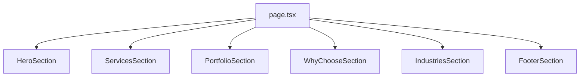

# Growza: Cursor Rules + Premium Website Plan

## Context

- Workspace [`d:\Company`](d:\Company) is **empty** — full greenfield setup.
- Stack: **Next.js (App Router) + TypeScript + Tailwind CSS v4 + shadcn/ui + Framer Motion**.
- Rules adapted from your other project; **Flutter mirroring removed**; **mobile-first + performance** retained.

---

## Part 1 — Cursor Rules Configuration

Create [`.cursor/rules/`](.cursor/rules/) with **focused `.mdc` files** (one concern each, ~40–80 lines). Per the [create-rule skill](C:\Users\User.cursor\skills-cursor\create-rule\SKILL.md), use YAML frontmatter with `alwaysApply` or `globs`.

### Rule files to create

| File                       | Scope                      | Purpose                                                                                                                                           |
| -------------------------- | -------------------------- | ------------------------------------------------------------------------------------------------------------------------------------------------- |
| `project-core.mdc`         | `alwaysApply: true`        | DRY, read-before-write, 200-line file cap, mobile-first, performance (lazy motion, `next/image`, minimal client components)                       |
| `design-tokens.mdc`        | `globs: **/*.{tsx,css}`    | Growza brand: no hardcoded colors/fonts; use `colors.ts`, `typography.ts`, `globals.css` `@theme` / `--color-brand-*`; luxury dark+gold aesthetic |
| `constants-and-routes.mdc` | `globs: **/*.{ts,tsx}`     | All copy, labels, dimensions, regex, route strings → `src/lib/constants/*.ts`; routes → `routes.ts`; assets → `assets.ts`                         |
| `react-components.mdc`     | `globs: **/*.tsx`          | shadcn primitives in `ui/`; shared in `common/`; feature in `<feature>/`; `cn()` only; **no inline `style={{}}`**; **no prop types in `.tsx`**    |
| `typescript-types.mdc`     | `globs: **/*.{ts,tsx}`     | All `interface`/`type` in `src/types/` (incl. `src/types/ui/`); `.tsx` imports types only                                                         |
| `api-and-env.mdc`          | `globs: src/**/*.{ts,tsx}` | `NEXT_PUBLIC_API_BASE_URL` via `src/lib/env.ts`; API segments in `api.ts`; hooks in `src/hooks/use*.ts`                                           |

### Key adaptations from your other project

**Kept:**

- Token-driven design (colors, typography, assets, routes, constants)
- shadcn/ui + `cn()` + Tailwind-only styling
- Types in `.ts` files only
- 200-line file limit with splits
- Mobile-first responsive layout

**Removed / changed:**

- ~~Mirror Flutter widget names~~ → use **semantic React names** (e.g. `HeroSection`, `ServiceCard`, `StatsCounter`)
- ~~Flutter parity comments~~ → optional brief JSDoc on complex animation components only

**Added (Growza-specific) in `design-tokens.mdc`:**

- Approved palette only: `#0A0A0A`, `#111111`, `#1A1A1A`, gold `#D4AF37`, gradient `#FFD700 → #D4AF37 → #B8860B`, text `#FFFFFF` / `#E5E5E5`
- Avoid bright colors, cartoon art, generic template look
- Premium patterns: glassmorphism, gold glow borders, subtle gradients, Framer Motion for scroll/hover
- Prefer CSS variables + Tailwind `@theme` over arbitrary `text-[…]` / `bg-[…]`

### Example frontmatter (core rule)

```yaml
---
description: Growza core standards — DRY, file size, mobile-first, performance
alwaysApply: true
---
```

---

## Part 2 — Project Scaffold

```bash
npx create-next-app@latest . --typescript --tailwind --eslint --app --src-dir --import-alias "@/*"
npx shadcn@latest init
npx shadcn@latest add button card separator
npm install framer-motion
```

### Target folder structure

```
d:\Company\
├── .cursor/rules/          # 6 rule files above
├── src/
│   ├── app/
│   │   ├── layout.tsx      # fonts, metadata, smooth scroll
│   │   ├── page.tsx        # composes sections only (~30 lines)
│   │   └── globals.css     # @theme tokens, gold glow utilities
│   ├── components/
│   │   ├── ui/             # shadcn
│   │   ├── common/         # SectionHeader, GlowCard, GoldButton, Spotlight
│   │   └── home/           # HeroSection, ServicesSection, etc.
│   ├── hooks/
│   │   └── useAnimatedCounter.ts
│   ├── lib/
│   │   ├── constants/
│   │   │   ├── index.ts
│   │   │   ├── colors.ts
│   │   │   ├── typography.ts
│   │   │   ├── assets.ts
│   │   │   ├── routes.ts
│   │   │   ├── home.ts     # hero copy, stats, services, industries
│   │   │   └── footer.ts
│   │   ├── env.ts
│   │   └── utils.ts        # cn()
│   └── types/
│       ├── index.ts
│       └── ui/             # GlowCardProps, StatItem, ServiceItem, etc.
├── public/assets/          # logos, dashboard mockups, OG image
└── components.json
```

---

## Part 3 — Design System Foundation

### [`src/lib/constants/colors.ts`](src/lib/constants/colors.ts)

Export semantic tokens mapped to CSS variables:

```typescript
export const BRAND_COLORS = {
  bgPrimary: "var(--color-brand-bg-primary)", // #0A0A0A
  bgSecondary: "var(--color-brand-bg-secondary)",
  gold: "var(--color-brand-gold)",
  textPrimary: "var(--color-brand-text-primary)",
  // ...
} as const;
```

### [`src/app/globals.css`](src/app/globals.css)

Define `@theme` + utility classes:

- `--color-brand-*` for all brand colors
- `--gradient-gold-luxury` for `#FFD700 → #D4AF37 → #B8860B`
- Reusable utilities: `.gold-glow`, `.glass-card`, `.gold-border-gradient`, `.section-divider`
- `scroll-behavior: smooth` on `html`

### [`src/lib/constants/typography.ts`](src/lib/constants/typography.ts)

Compose feature-level class strings (e.g. `HERO_TYPO`, `SECTION_TITLE`) from theme font tokens — no raw `text-4xl font-bold` in components.

### Fonts

Use **next/font**: a premium pairing such as **Inter** (body) + **Playfair Display** or **Cormorant Garamond** (headlines) — registered in `layout.tsx`, referenced only via typography constants.

---

## Part 4 — Shared Premium Components

Build reusable pieces in [`src/components/common/`](src/components/common/) (each file &lt; 200 lines):

| Component             | Role                                                            |
| --------------------- | --------------------------------------------------------------- |
| `Spotlight.tsx`       | Mouse-following radial gold spotlight on hero/sections (client) |
| `ParticleField.tsx`   | Lightweight canvas/CSS animated particles (client, lazy)        |
| `GlowCard.tsx`        | Glass card + gold border on hover                               |
| `GoldButton.tsx`      | shadcn Button wrapper with primary/ghost gold variants          |
| `SectionHeader.tsx`   | Title + gold line accent + optional subtitle                    |
| `AnimatedCounter.tsx` | Framer Motion + `useAnimatedCounter` for stats                  |
| `PageTransition.tsx`  | Optional subtle fade on route change (future pages)             |

All visual values (glow blur, border width, animation duration) → constants in [`src/lib/constants/animations.ts`](src/lib/constants/animations.ts) or [`home.ts`](src/lib/constants/home.ts).

---

## Part 5 — Page Sections (Home)

[`src/app/page.tsx`](src/app/page.tsx) wires sections only:



### Hero ([`src/components/home/HeroSection.tsx`](src/components/home/HeroSection.tsx))

- Headline: _"Premium Digital Solutions for Growing Businesses"_
- Subheadline + CTAs: **Get Free Consultation** / **View Our Work**
- Background: deep black + particle field + spotlight
- Floating dashboard mockup (import path from `assets.ts`)
- Framer Motion: staggered text reveal, subtle float on mockup

### Services ([`src/components/home/ServicesSection.tsx`](src/components/home/ServicesSection.tsx))

- Luxury `GlowCard` grid: websites, web apps, automation (copy in `home.ts`)
- Gold hover glow + scale

### Portfolio ([`src/components/home/PortfolioSection.tsx`](src/components/home/PortfolioSection.tsx))

- Dark premium project cards with gold accent line
- Placeholder projects in constants until real case studies exist

### Why Choose Growza ([`src/components/home/WhyChooseSection.tsx`](src/components/home/WhyChooseSection.tsx))

Animated counters (constants in `home.ts`):

- Projects Delivered
- Happy Clients
- Industries Served
- Support Availability (e.g. 24/7)

### Industries ([`src/components/home/IndustriesSection.tsx`](src/components/home/IndustriesSection.tsx))

Grid/chips: Real Estate, Healthcare, Education, Construction, Manufacturing, Restaurants, Travel, Startups

### Footer ([`src/components/home/FooterSection.tsx`](src/components/home/FooterSection.tsx))

- Growza + tagline _"Building Digital Growth"_
- Contact block + social icons (Lucide via shadcn)
- Gold typography on black

---

## Part 6 — Data & Content Constants

All user-facing strings in [`src/lib/constants/home.ts`](src/lib/constants/home.ts):

```typescript
export const HOME_HERO = {
  headline: "Premium Digital Solutions for Growing Businesses",
  subheadline: "We build high-performance websites...",
  primaryCta: "Get Free Consultation",
  secondaryCta: "View Our Work",
} as const;

export const HOME_STATS = [
  /* ... */
] as const;
export const HOME_SERVICES = [
  /* ... */
] as const;
export const HOME_INDUSTRIES = [
  /* ... */
] as const;
export const HOME_PORTFOLIO = [
  /* ... */
] as const;
```

Routes in [`src/lib/constants/routes.ts`](src/lib/constants/routes.ts):

```typescript
export const ROUTES = {
  home: "/",
  consultation: "/consultation", // future
  work: "/#portfolio",
} as const;
```

---

## Part 7 — Performance Guidelines (enforced in rules + implementation)

- **Server Components by default**; `"use client"` only for Spotlight, particles, counters, hover animations
- **Dynamic import** heavy client widgets: `dynamic(() => import(...), { ssr: false })`
- **`next/image`** for all mockups with explicit `width`/`height`
- **Framer Motion**: use `whileInView` + `viewport={{ once: true }}` to avoid re-triggering
- **Reduce motion**: respect `prefers-reduced-motion` in globals.css and animation components
- **No layout shift**: reserve space for hero mockup and stat blocks
- **Lighthouse target**: 90+ performance on mobile (minimal JS on first paint)

---

## Part 8 — Implementation Order

1. **Cursor rules** — all 6 `.mdc` files (unblocks consistent AI-assisted development)
2. **Scaffold** — Next.js + shadcn + Framer Motion + ESLint
3. **Tokens** — `globals.css`, `colors.ts`, `typography.ts`, `animations.ts`
4. **Common components** — GlowCard, GoldButton, SectionHeader, Spotlight, ParticleField
5. **Home sections** — Hero → Services → Portfolio → Stats → Industries → Footer
6. **Polish** — hover glows, gradient borders, smooth scroll, reduced-motion fallbacks
7. **Metadata** — SEO title/description, OG image, favicon

---

## Deliverable Checklist

After implementation, the site should:

- Feel premium, corporate, trustworthy (dark black + gold only)
- Have all 6 home sections with specified copy and CTAs
- Use zero hardcoded colors, fonts, paths, or copy in `.tsx` files
- Split any file approaching 200 lines
- Pass `npm run build` with no TypeScript errors
- Score well on mobile Lighthouse (minimal client JS)
